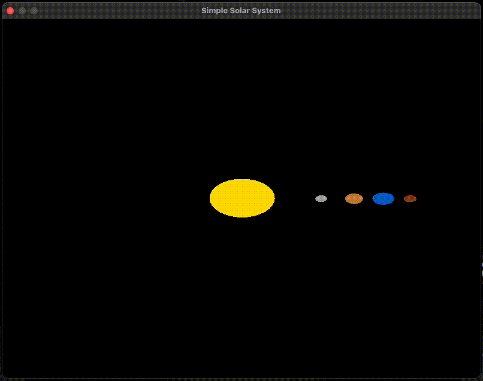

# Rust Graphics Renderer

Este proyecto es un renderizador 3D simple basado en Rust. Utiliza la librería `minifb` para crear una ventana y `nalgebra_glm` para manejar las matemáticas de las transformaciones 3D. El renderizador puede cargar modelos 3D en formato `.obj` y aplicar transformaciones como traslación, rotación y escalado. También implementa un sistema de iluminación básica, incluyendo una luz direccional y luz ambiente.

## Características

- Renderizado de modelos 3D a partir de archivos `.obj`.
- Iluminación estática direccional y ambiental.
- Transformaciones como rotación, escalado y traslación.
- Interacción con la cámara para orbitar alrededor de los modelos.
- Control de zoom mediante teclado.

## Requisitos

Para ejecutar este proyecto, necesitarás tener instalados los siguientes elementos:

- Rust: [Instalación](https://www.rust-lang.org/tools/install)
- Cargo (viene con Rust)

Además, el proyecto utiliza las siguientes dependencias, que se especifican en el archivo `Cargo.toml`:

```toml
minifb = "0.27.0"
nalgebra-glm = "0.19.0"
tobj = "4.0.2"
```

#### Estructura del Proyecto

- `camera.rs`: Implementa la cámara y sus movimientos, incluyendo zoom y rotaciones.
- `color.rs`: Define la estructura de color y operaciones aritméticas con colores.
- `fragment.rs`: Maneja los fragmentos del pipeline gráfico.
- `framebuffer.rs`: Implementa el framebuffer, donde se almacenan los píxeles renderizados.
- `line.rs`: Algoritmo para dibujar líneas.
- `obj.rs`: Carga archivos `.obj` y los convierte en un array de vértices.
- `shaders.rs`: Define el shader de vértices, que transforma los vértices usando las matrices de transformación.
- `triangle.rs`: Implementa la rasterización de triángulos y la aplicación de iluminación.
- `vertex.rs`: Define la estructura de un vértice.

## Instrucciones de Uso

### 1. Clonar el repositorio

Primero, clona este repositorio en tu máquina local:

```bash
git clone https://github.com/Jorge162017/Proyecto3-GC.git
cd Proyecto3-GC
```

### 2. Compilar el proyecto

Asegúrate de que tienes Rust instalado en tu máquina. Puedes compilar el proyecto usando Cargo:

```bash
cargo build
```

### 3. Ejecutar el proyecto

#### En Windows

Para ejecutar el renderizador en Windows, simplemente utiliza el siguiente comando en la terminal (cmd):

```bash
./run.bat
```

#### En Linux

Para ejecutar el renderizador en Linux, usa el siguiente comando en tu terminal:

```bash
./run.sh
```

Ambos archivos (tanto `run.bat` como `run.sh`) cambian automáticamente al directorio donde están ubicados y ejecutan el proyecto usando `cargo run --release`.

Esto abrirá una ventana donde se renderizarán modelos 3D: un `sphere.obj` 

### 4. Controles de cámara

Puedes interactuar con la cámara utilizando las siguientes teclas:

- `W`: Acercar la cámara (zoom in).
- `S`: Alejar la cámara (zoom out).
- `A`: Rotar la cámara a la izquierda.
- `D`: Rotar la cámara a la derecha.
- `Q`: Elevar la cámara.
- `E`: Bajar la cámara.
- `ESC`: Salir del programa.

### 5. Modelos 3D

Los modelos 3D deben estar en la carpeta `assets/models/`. Puedes cambiar los modelos cargando diferentes archivos `.obj` en el código fuente.

```rust
let obj = Obj::load("assets/models/nuevo_modelo.obj").expect("Failed to load obj");
```

# Ejemplo de Uso

El siguiente es un ejemplo visual de lo que verás al ejecutar el programa:

- Un sistema solar donde los planetas rotan constantemente.
- La luz direccional estática ilumina el modelo.



